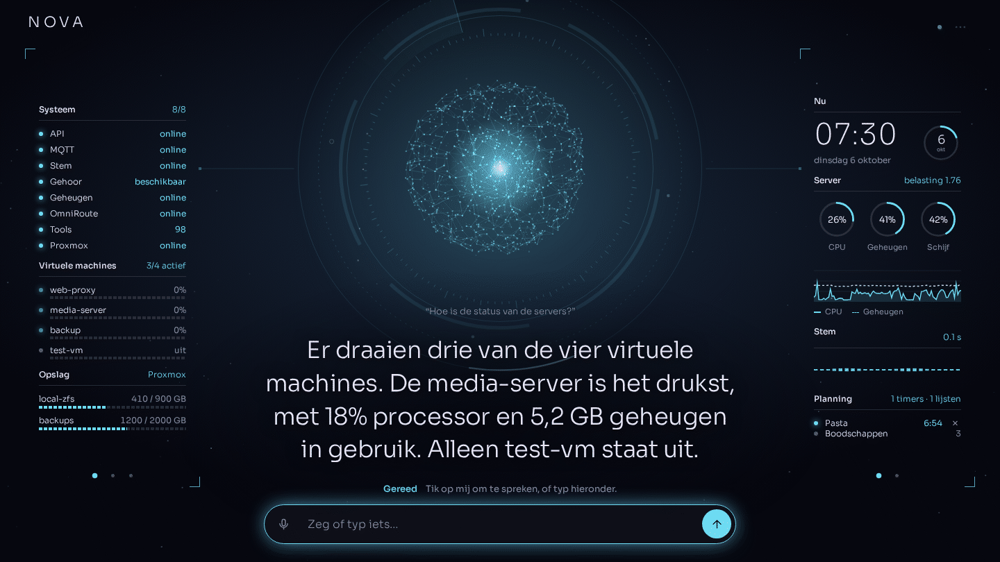
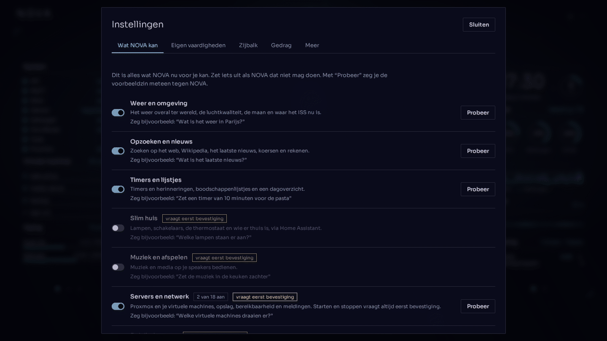
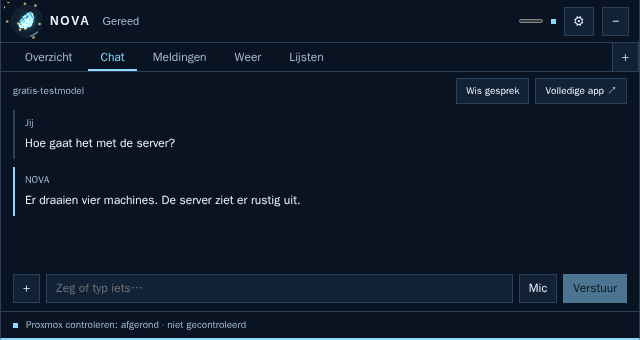
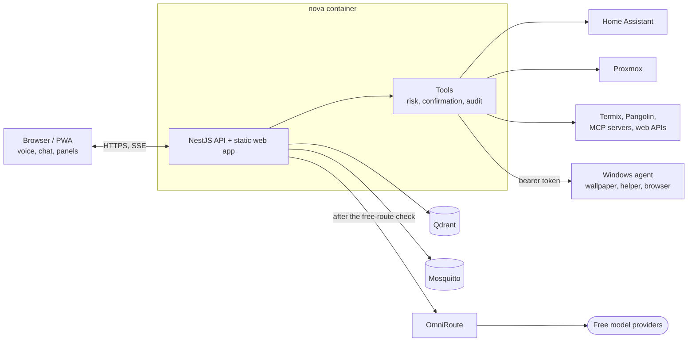

# NOVA

NOVA is a self-hosted personal AI assistant for your home and your servers. It is a living interface, a particle sphere with side panels, that you talk to ("Hey NOVA") or type to. It shows the state of your servers, your smart home and the world around you, answers with streaming text and a spoken voice, and can act on your behalf through tools, always asking for confirmation before anything risky. It only talks to language models through a verified free route, and it runs as one Docker image next to the services it uses.

> The interface and the spoken voice are in Dutch. The code, the model-facing tool descriptions and all documentation are in English.



## What it does

- **Voice and chat.** Say "Hey NOVA" (the browser's speech recognition listens along) or tap the sphere, or type. Answers stream in as they are generated and are spoken with a neural Dutch voice.
- **Side panels.** A dashboard around the sphere: this server, Proxmox virtual machines and storage, weather, air quality, moon, smart home, markets, ISS position, news, timers and lists, recent activity. You choose which panels are shown and on which page, and you can add your own panels (a live value or list from a web address, buttons, notes) in the settings.
- **Tools with risk levels.** Around a hundred tools in four risk levels (`READ_ONLY`, `SAFE`, `CONFIRM`, `DANGEROUS`). Anything that is not harmless is confirmed by you first ("ja" / "nee", or a button), with a 60 second single-use confirmation. Every action is written to an audit log, and secrets are masked everywhere. Out of the box NOVA is read-only until you set `JARVIS_ENABLE_ACTIONS=true`.
- **Free models only, fail-closed.** All model traffic goes through [OmniRoute](https://github.com/diegosouzapw/OmniRoute). Before every request NOVA verifies that the route is a verified free one; if it cannot, it sends nothing.
- **Memory.** Short-term conversation context, and long-term memory in Qdrant (with free embeddings) or in OmniRoute's native memory. NOVA only remembers what you explicitly ask it to, and never credentials.
- **Your own skills and panels.** In the settings you can write instruction skills (a routine NOVA follows with its existing tools) and webhook skills (an HTTP call that becomes a tool), with an AI assistant to help draft them, and custom sidebar panels.
- **Integrations.** Proxmox VE, Home Assistant (lights, climate, scenes, Sonos and media), MQTT, Termix (SSH hosts, confirmed commands), Pangolin, any MCP server, weather, news, web search and more. Node-RED is optional, for your own flows.
- **Windows agent.** A small PowerShell agent that lets NOVA open allow-listed programs, show NOVA as living wallpaper behind your icons (per display), show a small always-on-top **helper** panel, and use a browser of its own (search, read, click, type) with safety limits.
- **PWA.** Installable on a phone or PC from the browser, with its own icon.

| Settings dialog                                                                                                 | Rectangular helper panel on the Windows PC                                                           |
| --------------------------------------------------------------------------------------------------------------- | ---------------------------------------------------------------------------------------------------- |
|  |  |

The screenshots show mocked data. Settings texts are Dutch ("Instellingen" = settings, "Wat NOVA kan" = what NOVA can do).

## Architecture



One image holds the NestJS API and the built SvelteKit app. See [docs/architecture.md](docs/architecture.md).

## Quick start (Docker)

You need Docker with the Compose plugin and outbound internet. NOVA has no login of its own: run it on a trusted network or behind an authenticating reverse proxy.

```sh
mkdir nova && cd nova
curl -fsSLO https://raw.githubusercontent.com/hjongedijk/nova/main/deploy/docker-compose.yml
curl -fsSL  https://raw.githubusercontent.com/hjongedijk/nova/main/.env.example -o .env
mkdir -p nova-data && sudo chown -R 1000:1000 nova-data   # NOVA runs as user "node"
# edit .env: at least OMNIROUTE_API_KEY; set NOVA_VERSION to a release, or leave it on latest
docker compose pull && docker compose up -d
```

Open `http://<nova-host>:8080`. The stack contains NOVA, OmniRoute, Mosquitto, Qdrant, Home Assistant and an optional Node-RED. For the AI to answer, add your free provider accounts in OmniRoute (`http://<nova-host>:20128`) and provide the routing policy NOVA verifies, as described in [docs/omniroute.md](docs/omniroute.md).

- **HTTPS and microphone.** Browsers allow the microphone ("Hey NOVA") and app installation only on HTTPS or `localhost`. Put a reverse proxy in front (and set `NOVA_PUBLIC_URL`), or place `cert.pem` and `key.pem` in `nova-data/certs/` for NOVA's own HTTPS port 8443. For a private CA, add `nova-ca.crt` there; NOVA serves it at `/nova-ca.crt` for your devices.
- **Where data lives.** `nova-data/` holds settings, memory, the action log and the routing policy; OmniRoute, Qdrant, Home Assistant and Node-RED keep their data in their own `*-data/` folders next to the compose file. Back them up.
- **Update.** Set `NOVA_VERSION` in `.env`, then `docker compose pull && docker compose up -d`.

The full walk-through is in [docs/getting-started.md](docs/getting-started.md).

## Configuration

Settings come from environment variables (`.env`, documented in full in [docs/configuration.md](docs/configuration.md) with defaults and which values are secret) and from the Settings screen in the interface (tools, skills, panels, persona, quick actions, Windows PC, back-up). Integrations stay off until you configure them.

## Safety model

- **Read-only by default.** `JARVIS_ENABLE_ACTIONS=false` refuses every tool that changes something.
- **Risk levels and confirmation.** `CONFIRM` and `DANGEROUS` actions need your explicit, single-use confirmation within 60 seconds; `SAFE` actions run directly (configurable).
- **Validated arguments.** Tool arguments are cleaned and checked against a schema before anything runs.
- **Audit log and masking.** Every action goes to an append-only log, and secrets are redacted from logs, results and model context.
- **Network guard.** Tools that fetch URLs refuse private, loopback and internal addresses, checked at connect time.
- **Fail-closed AI routing.** No verified free route means no model request.
- **Limits.** There is no user authentication on the chat and tool endpoints (only the settings can have a PIN), so keep NOVA off the open internet.

Details: [docs/tools-and-safety.md](docs/tools-and-safety.md).

## Windows agent

`agents/windows` contains a PowerShell agent for a Windows PC. It runs in your desktop session, authenticates with a bearer token, only accepts calls from the NOVA host and only starts programs you list in `agent.json`. It can show NOVA as living wallpaper per display, as a small helper overlay, or both, and gives NOVA a visible Edge window to browse in. It is verified in CI only for syntax and compilation, not on real Windows machines. Install and details: [docs/windows-agent.md](docs/windows-agent.md). The helper has overview/chat/notifications tabs, optional weather/lists, file drops, scoped approvals, configurable shortcuts and a tray. Design/screenshots: [docs/helper-design.md](docs/helper-design.md). Kiosk bounds, DPI and device behavior still need a real Windows test.

## Development

Requirements: Node 24 and Docker.

```sh
cp .env.example .env                              # fill in the keys you have
docker compose -f docker-compose.dev.yml up -d    # OmniRoute, MQTT, Qdrant
npm install
set -a; . ./.env; set +a                          # NOVA reads real environment variables, not .env
npm run dev                                       # API on :3000, web on :5173 (proxies /api)
```

| Command                              | Does                                    |
| ------------------------------------ | --------------------------------------- |
| `npm run dev`                        | API (watch) and web (Vite) side by side |
| `npm test`                           | API tests (Vitest)                      |
| `npm run lint` / `npm run typecheck` | ESLint / TypeScript and svelte-check    |
| `npm run format` / `format:check`    | Prettier (write / check)                |
| `npm run build`                      | Web, then API                           |
| `docker build -t nova .`             | The production image                    |

Runtime data of the dev server goes to `dev-data/` (ignored by git). More in [docs/development.md](docs/development.md).

## Versioning and releases

Versions are git tags `vMAJOR.MINOR.PATCH`. The project is in the `v0.1.x` series and bumps the PATCH number for every release (`v0.1.1`, `v0.1.2`, ... up to `v0.1.99`), then moves on to `v0.2.0`. To release:

```sh
git tag vX.Y.Z && git push origin vX.Y.Z
```

The tag starts a GitHub Actions workflow that publishes the multi-architecture image `ghcr.io/hjongedijk/nova:X.Y.Z` (plus `X.Y` and `latest`) and a GitHub release with `nova-windows-agent.zip` and the production `docker-compose.yml`. See [docs/releasing.md](docs/releasing.md).

## Documentation

Everything is indexed in [docs/README.md](docs/README.md).

## License

[MIT](LICENSE)
