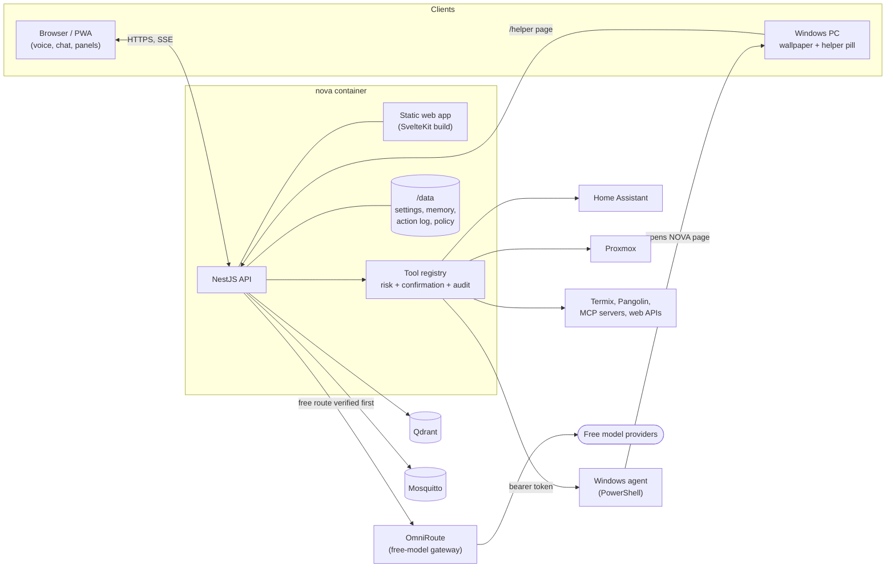

# Architecture

## Overview

NOVA ships as **one Docker image**: a NestJS API that also serves the built SvelteKit web app as static files, so there is no separate web server. Speech (Microsoft neural voices through `msedge-tts`) and NOVA's own tools (Proxmox, timers, lists, checks) are modules of the API and need no container of their own. The services NOVA talks to keep their own images: OmniRoute, Mosquitto, Qdrant, Home Assistant and, optionally, Node-RED for your own flows.

All runtime state lives outside the image in the data folder (`nova-data/` in production, `dev-data/` in development): settings, memory, the action log, the routing policy, MCP configuration and certificates. Nothing in the repository changes at runtime and no secret is committed. See [Configuration](configuration.md#the-data-folder).

## Repository layout

| Path                 | What                                                                                              |
| -------------------- | ------------------------------------------------------------------------------------------------- |
| `apps/api`           | NestJS backend (ESM, TypeScript strict). One folder per domain. Serves the web app in production. |
| `apps/web`           | SvelteKit app built with `adapter-static` (single-page, fallback `index.html`) and Svelte 5.      |
| `packages/contracts` | Types shared by API and web, types only.                                                          |
| `agents/windows`     | The PowerShell Windows agent. See [Windows agent](windows-agent.md).                              |
| `deploy`             | Production `docker-compose.yml` and the default `mcp-servers.json`.                               |
| `docs`               | This documentation.                                                                               |

Rules that keep it clean:

- A module in `apps/api` uses another module only through what that module exports (its service), never by importing its files.
- `core/` holds what every module needs (config, security, audit, state, MQTT, HTTP helpers) and knows no domain.
- Configuration is read once in `NovaConfig` (`core/config/nova-config.ts`); the rest of the code does not read `process.env` (two documented exceptions: the secret masking and `NODE_EXPORTER_URL`, plus MCP `${VAR}` references).
- Components in `apps/web` never call `fetch` themselves; all calls go through `src/lib/api/`.
- Types that cross the API boundary live in `packages/contracts` and are imported with `import type`.
- Relative imports in the API use the `.js` extension (ESM, NodeNext).

## API modules

One folder per domain under `apps/api/src/`, wired together in `app.module.ts`. All routes live under `/api` except `/windows-agent/jarvis-agent.ps1` and `/nova-ca.crt`.

| Module                          | Does                                                                                                                                                                                                                                            |
| ------------------------------- | ----------------------------------------------------------------------------------------------------------------------------------------------------------------------------------------------------------------------------------------------- |
| `core`                          | `NovaConfig`, `sanitize`, net guard and safe requests, JSON client, audit log, component state, MQTT, error shape.                                                                                                                              |
| `health`                        | `GET /api/nova/health`.                                                                                                                                                                                                                         |
| `tools`                         | The registry and the one way to run a tool: clean and check arguments, decide the real risk, ask for confirmation, write the log. Tool sources register themselves with `@ToolSourceProvider()`. `GET /api/tools`, `POST /api/actions/execute`. |
| `confirmations`                 | Pending confirmations (60 s, single use, one per session) and the words for asking and answering.                                                                                                                                               |
| `chat`                          | `POST /api/chat`, `POST /api/chat-stream` (server-sent events), `POST /api/actions/confirm`. The orchestrator (tool loop), prompt, context builder, OmniRoute client and the spoken summary of command output.                                  |
| `memory`                        | Conversations and session context (`memory.json`); long-term memory in Qdrant or OmniRoute; `/api/memories`, `/api/memory/:session`, `/api/audit`.                                                                                              |
| `routing`                       | The free-model policy check, OmniRoute's management API, `/api/providers`, `/api/gateway`. See [OmniRoute](omniroute.md).                                                                                                                       |
| `settings`                      | Skills, persona, quick actions, tool switches, sidebar, custom panels (widgets), back-up, wallpaper and helper pickers; `/api/settings/*`, `/api/widgets/*`.                                                                                    |
| `dashboard`                     | `/api/system` (host metrics), `/api/overview`, `/api/alerts`, `/api/health` (integration status), `/api/integrations`.                                                                                                                          |
| `tts`                           | `POST /api/tts`: speech with Microsoft's neural voices (`nl-NL-MaartenNeural`), in Node, with a small sentence cache.                                                                                                                           |
| `proxmox`, `planning`, `checks` | Guests, storage and tasks; timers, lists and the daily briefing; reachability checks and the watchdog that raises alerts. They also provide `system_time`.                                                                                      |
| `home`                          | Home Assistant: catalog of entities, tools, risk rules, verification of effects, `GET /api/entities`.                                                                                                                                           |
| `integrations/*`                | `world` (weather, search, news, ...), `mcp` (MCP client hub), `termix` (with direct SSH fallback), `windows` (programs, wallpaper, helper), `browser-agent` (the `browser_*` tools, served by the same Windows agent), `pangolin`, `youtube`.   |
| `downloads`                     | The Windows agent script and the CA certificate, for devices that need them.                                                                                                                                                                    |
| `bridges`                       | The glue where one module needs something another owns, by an agreed shape.                                                                                                                                                                     |

### The bridges

`bridges/bridges.module.ts` keeps modules independent of each other. It provides:

- `LLM_CLIENT`: the settings module asks the language model for help (skill drafting and improving) without knowing OmniRoute; it is the same `OmniRouteClient` the chat uses, so the free-route check applies to it too.
- `WALLPAPER_PORT`: the settings screen sets the Windows wallpaper, mode and helper size without knowing the Windows agent.
- `HOME_ALIAS_LOOKUP`: Home Assistant resolves names the user taught NOVA ("the big lamp") through long-term memory entries of type `LEARNED_ALIAS`.
- A home source for the weather tools: "home" follows Home Assistant's `zone.home`.

## A chat request

1. The web app posts to `/api/chat-stream` and reads server-sent events (`connected`, `tools`, `token`, `tool_start`, `tool_result`, `confirmation`, `done`, `error`).
2. The orchestrator first checks whether the message answers a pending confirmation ("ja", a confirm button).
3. Otherwise it verifies the free route (it throws and nothing is sent if that fails), builds the context (persona, matching instruction skills, session memory, relevant long-term memories) and calls OmniRoute with the enabled tools.
4. Tool calls the model makes (at most eight per reply, at most `JARVIS_MAX_TOOL_ITERATIONS` rounds) run through `ToolsService`. A call that needs confirmation ends the turn with a question and a confirmation card.
5. The answer streams to the browser, which speaks it with `/api/tts`. Every event is sanitised on the way out.

## Web app

`apps/web/src/`:

- `routes/+page.svelte`: the main view: the particle sphere, two columns of side panels, the stage with the conversation, the composer and the dialogs. `routes/helper/`: the compact helper page.
- `lib/api/`: one file per API area.
- `lib/chat/`: the chat stream (`ask`), SSE parsing, confirmation cards, alerts.
- `lib/entity/`: the particle sphere and the helper's orb (canvas).
- `lib/voice/`: speaking, listening (the browser's speech recognition), the "Hey NOVA" wake word, mobile audio unlock.
- `lib/modes/`: wallpaper mode, device detection, PWA registration.
- `lib/stores/`: shared state (Svelte 5 runes).
- `components/shell`, `hud`, `settings`, `admin`, `helper`, `ui`: one component per part of the screen. The built-in side panels are Systeem, Virtuele machines, Opslag, Buiten, Lucht, Maan en dag, Huis, Markt, ISS (left) and Nu, Server, Stem, Planning, Nieuws, Activiteit (right); custom panels come from Settings.
- `static/`: the web manifest, service worker and icons that make it an installable PWA. The microphone and installing need a secure origin: HTTPS (or `localhost`).

The interface text is Dutch and the speech voice is Dutch; the code, tool descriptions for the model and this documentation are English.

## Tests

- `apps/api/test`: Vitest, one folder per module, run with `npm test`.
- `agents/windows/test/check.ps1`: PowerShell syntax and the embedded C#, also run in CI.
- There is no end-to-end suite for the interface in the repository.
